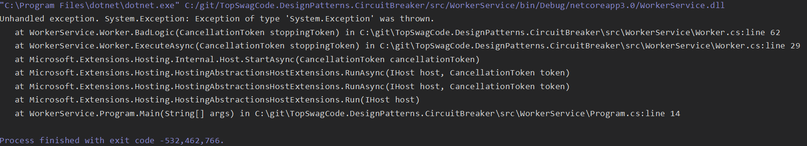
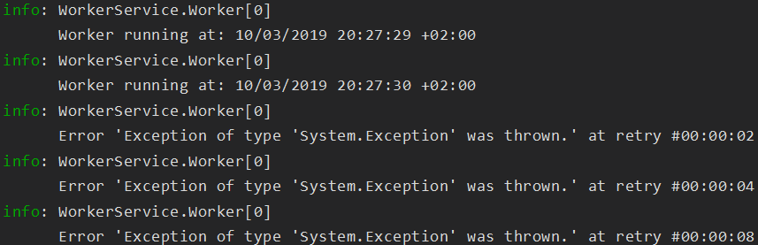

# TopSwagCode.DesignPatterns.CircuitBreaker

## WebAPI

Small sample project for how to implement CircuitBreaker pattern in Dotnet Core 3.0 with HttpClientFactory - Polly and a simple homemade one. Below can be seen a gif showing the project working with Polly (Click on image to view full size).

* On the left the sample ExternalService showing Logger for requests.
* Upper right OurService calling the ExternalService.
* Below right the ExternalService calling it self.


We can see the service working on the first call. Afterwards there is 3 call's that fail. Then we open the circuit and stop calling the service and instead instantly reply with a BrokenCircuitException. Ensureing our service does not waste resource calling a broken service and letting the external service get a chance of getting back into a stable state before we start using it again. 

If you want to read more about the Circuit Breaker Pattern you can find my blog post about it here: [https://topswagcode.com/2016/02/07/Circuit-Breaker-Pattern/](https://topswagcode.com/2016/02/07/Circuit-Breaker-Pattern/)

For the Polly project I created 2 Services.

* WeatherService
* WeatherServiceWithRetry

I add CircuitBreaker and Retry logic for them using [Polly](https://github.com/App-vNext/Polly).

``` csharp
    services.AddHttpClient<WeatherServiceWithRetry>( client =>
    {
        client.BaseAddress = new Uri("https://localhost:44366/");
    })
    .AddPolicyHandler(ServicePolicies.GetCircuitBreakerPolicy())
    .AddPolicyHandler(ServicePolicies.GetRetryPolicy())
    .SetHandlerLifetime(TimeSpan.FromMinutes(5));


    services.AddHttpClient<WeatherService>(client =>
    {
        client.BaseAddress = new Uri("https://localhost:44366/");
    })
    .AddPolicyHandler(ServicePolicies.GetCircuitBreakerPolicy())
    .SetHandlerLifetime(TimeSpan.FromMinutes(5));
```

To reuse my policies for multiple HttpClient's, I have put the policies in their own ServicePolicies.cs file. 

``` csharp
    public static class ServicePolicies
    {
        public static IAsyncPolicy<HttpResponseMessage> GetCircuitBreakerPolicy()
        {
            return HttpPolicyExtensions
                .HandleTransientHttpError()
                .CircuitBreakerAsync(3, TimeSpan.FromSeconds(10));
        }

        public static IAsyncPolicy<HttpResponseMessage> GetRetryPolicy()
        {
            return HttpPolicyExtensions
                .HandleTransientHttpError()
                .OrResult(msg => msg.StatusCode == System.Net.HttpStatusCode.NotFound)
                .WaitAndRetryAsync(3, retryAttempt => TimeSpan.FromSeconds(Math.Pow(2, retryAttempt)));
        }
    }
```

The retry policy can be as creative as you want it. In my sample I am using Math.Pow with the number of retry attemps.
So I will retry 3 times at: 2, 4 and 8 seconds.

## Console App

TODO Add description for all the sample methods

Attempt 1 - Crash and burn


Attempt 2 - DDOSing your self


Attempt 3 - 3rd time is not the charm


Attempt 4 - Longer delay for retries


Attempt 5 - The never ending story


Attempt 6 - Circuit Breaker 


Improvements could still be done by combining Retries with Circuit Breaker, depending your usecase. Retries can also be improved. A regular Retry policy can impact your system in cases of high concurrency and scalability and under high contention. To overcome peaks of similar retries coming from many clients in case of partial outages, a good workaround is to add a jitter strategy to the retry algorithm/policy. This can improve the overall performance of the end-to-end system by adding randomness to the exponential backoff. This spreads out the spikes when issues arise. When you use a plain Polly policy, code to implement jitter could look like the following example:

``` csharp
    Random jitterer = new Random(); 
    Policy
    .Handle<HttpResponseException>()
    .WaitAndRetry(5,
        retryAttempt => TimeSpan.FromSeconds(Math.Pow(2, retryAttempt)) + TimeSpan.FromMilliseconds(jitterer.Next(0, 100)) 
    );
```

## Homemade Circuit Breaker

It's a simple implementation of Circuit breaker. Checking state before allowing calls. Recording failures and success to update state.

``` csharp
    public async Task ExecuteAsync(Func<Task> action)
    {
        if (AllowedToMakeCall() == false)
        {
            throw new CircuitBreakerException("Open Circuit. Stopping calls");
        }
        
        try
        {
            await action();
        }
        catch(Exception e)
        {
            
            RecordFailure();
            throw;
        }

        RecordSuccess();
    }
```

# Supported by:

[](https://www.jetbrains.com/?from=TopSwagCode)
